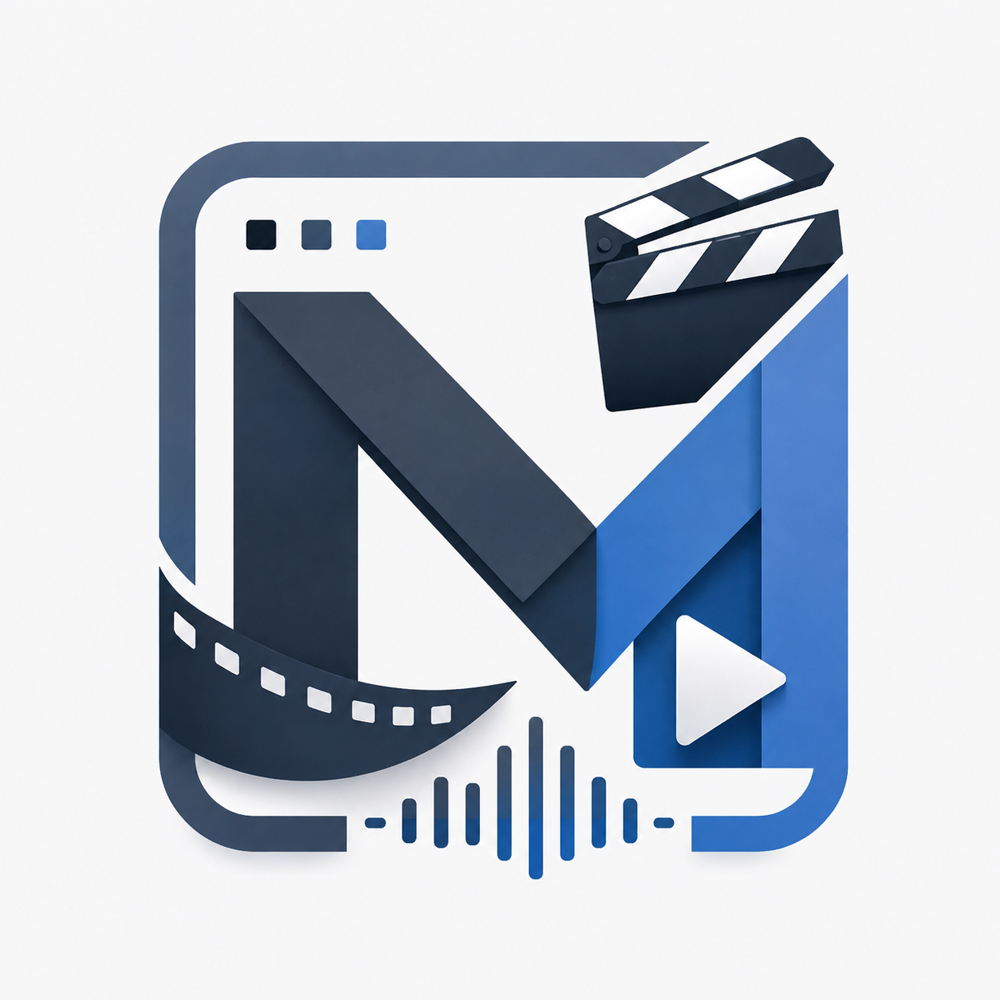

<div align="center">

  

  # 🎨 Multimedia Web Application (MWA)
  ### สถาปัตยกรรมเว็บแอปพลิเคชันตัดต่อและจัดการสื่อมัลติมีเดียระดับมืออาชีพ

  [](https://react.dev/)
  [](https://www.typescriptlang.org/)
  [](https://vitejs.dev/)
  [](https://tailwindcss.com/)
  [](https://sweetalert2.github.io/)
  [](https://vercel.com/)

  <p align="center">
    ระบบสตูดิโอตัดต่อและจัดการสื่อมัลติมีเดียผ่านเว็บเบราว์เซอร์ ที่ออกแบบภายใต้คอนเซปต์ <strong>Visual Comfort</strong> สบายตาด้วยโทน Slate Palette, โครงสร้าง UI แบบ Slightly Sharp/Professional, รองรับภาษาไทยสมบูรณ์แบบ, จัดการไฟล์จริงในเครื่องและ Google Drive พร้อมระบบกู้คืนอัตโนมัติ (Resilience Engine)
  </p>

</div>

---

## 📑 สารบัญ (Table of Contents)

1. [ปรัชญาการออกแบบและ UI/UX Architecture](#1-ปรัชญาการออกแบบและ-uiux-architecture)
2. [ฟีเจอร์เด่นของระบบ (Core Features)](#2-ฟีเจอร์เด่นของระบบ-core-features)
3. [โครงสร้างไฟล์โปรเจกต์ (Project Structure)](#3-โครงสร้างไฟล์โปรเจกต์-project-structure)
4. [ข้อกำหนดระบบและการติดตั้ง (Getting Started)](#4-ข้อกำหนดระบบและการติดตั้ง-getting-started)
5. [การตั้งค่า Google Drive Service (Google Cloud API)](#5-การตั้งค่า-google-drive-service-google-cloud-api)
6. [คู่มือการนำขึ้น GitHub และ Deploy บน Vercel](#6-คู่มือการนำขึ้น-github-และ-deploy-บน-vercel)
7. [ตารางคีย์ลัดการใช้งาน (Keyboard Shortcuts)](#7-ตารางคีย์ลัดการใช้งาน-keyboard-shortcuts)
8. [สถาปัตยกรรมความปลอดภัย (Security & Privacy Best Practices)](#8-สถาปัตยกรรมความปลอดภัย-security--privacy-best-practices)

---

## 1. 🎨 ปรัชญาการออกแบบและ UI/UX Architecture

ระบบถูกสร้างขึ้นตามข้อกำหนดการออกแบบอย่างเคร่งครัด เพื่อลดความเหนื่อยล้าของสายตาเมื่อต้องทำงานกับสื่อมัลติมีเดียต่อเนื่องเป็นเวลานาน:

```
+-----------------------------------------------------------------------------------+
| [Header] Logo • Multimedia Studio • Project Title [2K • 30fps] • Fullscreen • Export |
+-----------------------+-----------------------------------+-----------------------+
| [Media Assets]        | [Media Canvas / Player]           | [Inspector Panel]     |
| • Real File Import    | • 16:9 / 9:16 / 1:1 / 4:3         | • Text & Font Tuning  |
| • Folders (List-Down) | • Real Video & Subtitle Overlay   | • Opacity / Speed     |
| • Google Drive Import | • Timecode (00:00:00:00)          | • Volume / Color FX   |
| • Transfer Progress   | • Play / Pause / Seek / Fullscreen|                       |
+-----------------------+-----------------------------------+-----------------------+
| [Track Editor Resizer Bar (คลิกค้าง/แตะค้าง 2 วิ เพื่อปรับความสูง 160px - 550px)]   |
+-----------------------------------------------------------------------------------+
| [Multi-Track Timeline] Text Track, Video Track, Audio Track                       |
| • Drag & Drop Clilps Across Time & Tracks • Split Clip (S) • Delete (Del)        |
+-----------------------------------------------------------------------------------+
```

### 1.1 Palette สีถนอมสายตา (Ergonomic Slate Scheme)
- **Background (`bg-app-bg`):** `#F8FAFC` (Slate-50) ช่วยลดแสงจ้า (Anti-Glare)
- **Surface (`bg-app-surface`):** `#FFFFFF` พร้อมเส้นขอบ `#E2E8F0` (Slate-200) และ Soft Shadow เพื่อแบ่งโซนชัดเจน
- **Primary Text (`text-app-textMain`):** `#1E293B` (Slate-800) อ่านง่ายและสบายตากว่าสีดำสนิท
- **Accent Primary:** `#2563EB` (Blue-600) โทนสีฟ้าอมเทาแบบซอฟต์แวร์ระดับโปร

### 1.2 Border Radius ควบคุมความโค้งมนต่ำ (Professional Geometry)
- หลีกเลี่ยงความโค้งมนแบบวงกลม (`rounded-full`, `rounded-xl`)
- ใช้ **`rounded` (4px)** และ **`rounded-md` (6px)** เพื่อให้หน้าจอมีความคมเป็นระเบียบ คล้ายคลึงกับ Desktop Creative Suites

### 1.3 ระบบตัวอักษรรองรับภาษาไทยสมบูรณ์ (Typography)
- **Heading / UI Labels:** ฟอนต์ **"Prompt"** และ **"Kanit"** (ทันสมัย ชัดเจน)
- **Paragraph / Documents:** ฟอนต์ **"Sarabun"** และ **"Inter"** (อ่านสบายตาต่อเนื่อง)

### 1.4 SweetAlert2 Custom Styling Integration
- ปรับแต่ง Class ครอบทับ SweetAlert2 ดั้งเดิมทั้งหมด ให้กลมกลืนกับ TailwindCSS ด้วยขอบมน 6px, สี Backdrop แบบ Soft Slate (`rgba(15, 23, 42, 0.45)`) และไม่มี Balloon UI แปลกแยก

---

## 2. ⚡ ฟีเจอร์เด่นของระบบ (Core Features)

### 2.1 การนำเข้าไฟล์สื่อจริง (Real File Import & Automatic Metadata)
- **นำเข้าไฟล์จริงจากเครื่อง:** รองรับไฟล์วิดีโอ (`.mp4`, `.webm`, `.mov`), ไฟล์เสียง (`.mp3`, `.wav`, `.aac`) และรูปภาพ (`.png`, `.jpg`, `.svg`)
- **อ่าน Metadata อัตโนมัติ:** อ่านความยาวคลิป (Duration) และขนาดไฟล์จริงจากไบนารีไฟล์โดยตรง
- **จำกัดขนาดไฟล์วิดีโอ 4 GB:** ตรวจสอบความปลอดภัยไม่ให้ไฟล์เกิน 4 GB เพื่อป้องกันหน่วยความจำล้น
- **SweetAlert Transfer Progress Bar:** แสดงความเร็ว (MB/s) และเปอร์เซ็นต์ พร้อมปุ่ม **"ทำงานเบื้องหลัง (Background)"** โดยจะย้ายแถบ Progress ไปแสดงสดอยู่ในคลังสื่อจนกว่าจะเสร็จสิ้น

### 2.2 ระบบจัดการโฟลเดอร์ในคลังสื่อ (Folder Management & List-Down View)
- **สร้างโฟลเดอร์แยกหมวดหมู่:** จัดกลุ่มฟุตเทจ, เพลง, กราฟิก ได้ตามต้องการ
- **List-Down Expandable View:** คลิกที่โฟลเดอร์เพื่อกางออกดูรายการไฟล์แบบละเอียด หรือพับเก็บเพื่อประหยัดพื้นที่
- **เปลี่ยนชื่อไฟล์สื่อ (Rename):** ดับเบิลคลิกซ้ายที่ชื่อไฟล์ หรือกดไอคอนดินสอ เพื่อแก้ไขชื่อใหม่ได้ทันที

### 2.3 ไทม์ไลน์มัลติแทร็ก (Multi-Track Timeline Editor)
- **แผงปรับความสูงไทม์ไลน์ (Height Resizer Bar):** มีแถบ Bar ด้านบนสุด สามารถคลิกซ้ายค้างหรือแตะค้าง 2 วินาที แล้วเลื่อนขึ้น-ลง เพื่อปรับขนาดความสูงได้ตั้งแต่ 160px ถึง 550px
- **การลากย้ายคลิป (Holding Drag & Track Hopping):** คลิกซ้ายค้างหรือแตะค้าง เพื่อลากเลื่อนเวลาไปซ้าย-ขวา หรือ **ลากข้ามไปยัง Track อื่นๆ ขึ้น-ลง** ได้อย่างอิสระ
- **เปลี่ยนชื่อแทร็ก:** ดับเบิลคลิกซ้ายที่ชื่อ Track ในคอลัมน์ซ้ายเพื่อแก้ไขชื่อ
- **ลบแทร็กแบบ Cascade Cleanup:** ลบ Track ที่ไม่ต้องการ พร้อมระบบล้างคลิปทั้งหมดในแทร็กนั้นออกให้อัตโนมัติ
- **เครื่องมือตัดต่อ:** ปุ่มตัดคลิปที่ตำแหน่งเคอร์เซอร์ (Split Clip - <kbd>S</kbd>), ลบคลิป (<kbd>Del</kbd>), ปิดเสียงแทร็ก (Mute), และล็อกแทร็ก (Lock)

### 2.4 ระบบข้อความและฟอนต์ไดนามิก (Text & Dynamic Font System)
- **ปุ่ม "+ ข้อความ (Add Text)":** สร้างคลิปข้อความซับไตเติ้ลหรือพาดหัวไตเติ้ลลงบนไทม์ไลน์โดยตรง
- **ระบบฟอนต์หลากหลาย:**
  - ดึงฟอนต์ระบบเครื่องที่ใช้งานอยู่ (Prompt, Sarabun, Kanit, Inter, TH Sarabun New, Tahoma, Segoe UI ฯลฯ)
  - **อัปโหลดฟอนต์ใหม่ (`.ttf`, `.otf`, `.woff`, `.woff2`):** ติดตั้งฟอนต์เข้าสู่หน้าเว็บแบบเรียลไทม์ผ่าน FontFace API
- **เอฟเฟกต์ตัวอักษร (Text Effect Presets):**
  - **Drop Shadow:** เงาตกกระทบสร้างมิติ
  - **Neon Glow:** นีออนเรืองแสงสะดุดตา
  - **Outline Stroke:** เส้นขอบตัดกับพื้นหลัง
  - **Gradient Fill:** สีไล่เฉด 2 สี
  - **3D Extrusion:** ตัวอักษรนูน 3 มิติ
  - **Boxed Background:** กล่องข้อความสไตล์ซับไตเติ้ล
- **แก้ไขข้อความรวดเร็ว (Double Click Edit):** สามารถดับเบิลคลิกที่คลิปข้อความบนไทม์ไลน์ หรือดับเบิลคลิกที่ตัวอักษรบนหน้าจอ Preview Video เพื่อเปิดหน้าต่างแก้ไขได้ทันที

### 2.5 พื้นที่แสดงผลพรีวิวสื่อ (Media Canvas & Live Player)
- **รองรับหลายอัตราส่วน (Aspect Ratios):** สลับมุมมองได้ทั้ง 16:9 (Landscape), 9:16 (Shorts/Reels/TikTok), 1:1 (Square), และ 4:3 (Standard)
- **Timecode แสดงผลระดับเฟรม:** รูปแบบ `HH:MM:SS:FF` ตาม Frame Rate ของโปรเจกต์
- **โหมดเต็มหน้าจอ (Fullscreen):** ปุ่มขยายเต็มหน้าจอที่ Header และมุมขวาล่างของ Canvas พร้อมปุ่ม **"ปิดเต็มจอ (Esc)"** แสดงขึ้นมาเมื่อเปิดใช้งาน

### 2.6 รองรับความละเอียดระดับ 2K, 4K และระบบส่งออก (Export)
- รองรับการตั้งค่าโปรเจกต์และความละเอียดส่งออก:
  - **4K Ultra HD** (3840 x 2160)
  - **2K Quad HD** (2560 x 1440)
  - **1080p Full HD** (1920 x 1080)
  - **720p HD** (1280 x 720)
- ส่งออกไฟล์เป็น MP4 (H.264), WebM (VP9), GIF Animation หรือ MP3 Audio

### 2.7 การเชื่อมต่อ Google Drive Service
- **Google Picker Import:** ดึงไฟล์วิดีโอ, เสียง, ภาพจาก Google Drive เข้าสู่คลังสื่อของโปรเจกต์
- **Direct Cloud Upload:** ส่งออกไฟล์งานที่เรนเดอร์เสร็จแล้วขึ้น Google Drive โดยตรง
- **ความปลอดภัยสูงสุด:** ร้องขอสิทธิ์ OAuth 2.0 ขั้นต่ำแบบ `drive.file` เข้าถึงเฉพาะไฟล์ที่เปิดผ่านแอปเท่านั้น

### 2.8 ระบบป้องกันหน้าเว็บ Error Web (Resilience & Error Boundary)
- โมดูล `ErrorBoundary.tsx` ครอบระบบทั้งหมดไว้
- หากเกิดข้อผิดพลาดในการทำงาน ระบบจะแสดงหน้าต่าง **"System Recovery & Diagnostics Dashboard"** ในภาษาไทย พร้อมตรวจสอบสถานะ LocalStorage, Codecs, GPU Canvas และปุ่มคืนค่าเริ่มต้น / Safe Mode ให้อัตโนมัติ

---

## 3. 📂 โครงสร้างไฟล์โปรเจกต์ (Project Structure)

```
mwa/
├── public/
│   ├── logo.png               # โลโก้ของระบบ และ Favicon
│   └── favicon.png            # Favicon สำรอง
├── src/
│   ├── components/
│   │   ├── AssetSidebar.tsx   # คลังไฟล์สื่อ, โฟลเดอร์, การนำเข้าไฟล์จริง และ Google Drive
│   │   ├── ErrorBoundary.tsx  # ระบบป้องกัน Error Web & Diagnostic Dashboard
│   │   ├── Header.tsx         # แถบเมนูด้านบน, การตั้งค่า 2K/4K, Fullscreen, Export
│   │   ├── InspectorPanel.tsx # แผงปรับแต่ง Properties, Speed, Opacity, Color Filter
│   │   ├── MediaCanvas.tsx    # พื้นที่เล่นวิดีโอตัวอย่าง, ซับไตเติ้ลสด, Aspect Ratio
│   │   ├── TextEffectEditor.tsx# หน้าต่างแก้ไขข้อความ, อัปโหลดฟอนต์, และ Text Effects
│   │   └── Timeline.tsx       # ไทม์ไลน์มัลติแทร็ก, ตัวเลื่อนเวลา, Resizer Bar
│   ├── services/
│   │   └── googleDrive.ts     # โมดูลเชื่อมต่อ Google Drive API, GIS & Google Picker
│   ├── types/
│   │   └── index.ts           # TypeScript Type Definitions ทั้งหมด
│   ├── utils/
│   │   ├── fontManager.ts     # ระบบจัดการฟอนต์เครื่อง, อัปโหลดฟอนต์ และ Text Style Generator
│   │   └── swal.ts            # การตั้งค่า SweetAlert2 Mixin ร่วมกับ TailwindCSS
│   ├── App.tsx                # ตัวจัดการ State หลักของระบบ
│   ├── index.css              # Tailwind Directives และ Custom Scrollbar
│   └── main.tsx               # Entry Point ของแอปพลิเคชัน
├── data/
│   └── img/
│       └── logo.png           # ไฟล์ภาพโลโก้ต้นฉบับ
├── .env.example               # ตัวอย่างการตั้งค่า Environment Variables
├── .gitignore                 # ป้องกันการส่งไฟล์ Sensitive และ Secrets ขึ้น Git
├── package.json               # รายการ Dependencies และ Scripts
├── start_dev.bat              # สคริปต์รัน 1-Click บน Windows
├── tailwind.config.js         # การตั้งค่าสี Slate, ฟอนต์ Prompt/Sarabun, Radius
├── tsconfig.json              # TypeScript Compiler Options
├── vercel.json                # การตั้งค่า Routing และ Security Headers สำหรับ Vercel
└── README.md                  # เอกสารคู่มือการใช้งานระบบ
```

---

## 4. 🚀 ข้อกำหนดระบบและการติดตั้ง (Getting Started)

### ความต้องการของระบบ (Prerequisites)
- **Node.js**: เวอร์ชัน `18.0.0` ขึ้นไป (แนะนำ `20.x` หรือ `24.x`)
- **NPM**: เวอร์ชัน `9.x` หรือ `11.x`
- **เบราว์เซอร์**: Google Chrome, Microsoft Edge, Brave, Firefox หรือ Safari เวอร์ชันล่าสุด

### ขั้นตอนการรันระบบในเครื่อง (Local Development)

#### วิธีที่ 1: ดับเบิลคลิกไฟล์สคริปต์อัตโนมัติ (1-Click Run บน Windows)
ดับเบิลคลิกที่ไฟล์ **`start_dev.bat`** ในโฟลเดอร์โปรเจกต์ ระบบจะทำการตรวจสอบแพ็กเกจ เปิดเบราว์เซอร์ และรัน Development Server ให้ทันที

#### วิธีที่ 2: รันผ่าน Terminal / Command Line
```bash
# 1. ติดตั้ง Dependencies
npm install

# 2. เริ่มต้นรัน Development Server
npm run dev

# 3. ทดสอบการ Build สำหรับ Production
npm run build

# 4. ทดสอบรัน Production Build ในเครื่อง
npm run preview
```

เปิดเว็บเบราว์เซอร์ไปที่: **`http://localhost:5173`**

---

## 5. ☁️ คู่มือการตั้งค่าและเชื่อมต่อ Google Drive Service อย่างละเอียด (Step-by-Step)

การเชื่อมต่อกับ Google Drive ช่วยให้คุณสามารถ **ดึงไฟล์วิดีโอ/เพลง/รูปภาพจาก Google Drive** มาตัดต่อได้โดยตรง และ **อัปโหลดไฟล์งานที่เรนเดอร์เสร็จแล้วกลับขึ้น Google Drive** ได้ทันที โดยดำเนินการผ่าน **Google Cloud Console (ฟรี ไม่มีค่าใช้จ่ายสำหรับ API พื้นฐาน)** ตามขั้นตอนดังนี้:

---

### 🔹 ขั้นตอนที่ 1: สร้างโปรเจกต์บน Google Cloud Console
1. เข้าไปที่เว็บไซต์ [Google Cloud Console](https://console.cloud.google.com/) แล้วเข้าสู่ระบบด้วยบัญชี Google
2. กดที่เมนูเลือกโปรเจกต์ด้านบนซ้าย แล้วกดปุ่ม **"NEW PROJECT"**
3. ตั้งชื่อโปรเจกต์ เช่น `mwa-multimedia-studio` จากนั้นกดปุ่ม **"CREATE"**
4. รอระบบสร้างโปรเจกต์สักครู่ แล้วกดเลือกโปรเจกต์ที่เพิ่งสร้างขึ้นมา

---

### 🔹 ขั้นตอนที่ 2: เปิดใช้งาน APIs (Enable APIs)
1. ในแถบเมนูด้านซ้าย ไปที่ **APIs & Services > Library**
2. ค้นหาและกด **ENABLE** ทั้งหมด 2 บริการ:
   - 🔍 ค้นหาคำว่า **"Google Drive API"** -> คลิกเลือก -> กดปุ่ม **"ENABLE"**
   - 🔍 ค้นหาคำว่า **"Google Picker API"** -> คลิกเลือก -> กดปุ่ม **"ENABLE"** (ใช้สำหรับเปิดหน้าต่างเลือกไฟล์แบบ UI)

---

### 🔹 ขั้นตอนที่ 3: ตั้งค่าหน้าจอขอความยินยอม (OAuth Consent Screen)
1. ไปที่เมนู **APIs & Services > OAuth consent screen**
2. เลือก User Type เป็น **"External"** แล้วกดปุ่ม **"CREATE"**
3. **กรอกข้อมูลพื้นฐานของแอป:**
   - **App name:** `Multimedia Studio` (หรือชื่อตามต้องการ)
   - **User support email:** เลือกอีเมลของคุณ
   - **Developer contact information:** ใส่อีเมลของคุณ
   - กดปุ่ม **"SAVE AND CONTINUE"**
4. **กำหนดขอบเขตสิทธิ์ (Scopes):**
   - กดปุ่ม **"ADD OR REMOVE SCOPES"**
   - ค้นหาและติ๊กเลือกสิทธิ์:
     - `https://www.googleapis.com/auth/drive.file` *(เข้าถึงเฉพาะไฟล์ที่เปิด/สร้างผ่านแอปนี้)*
     - `https://www.googleapis.com/auth/drive.readonly` *(อ่านข้อมูลไฟล์)*
   - กดปุ่ม **"UPDATE"** แล้วกด **"SAVE AND CONTINUE"**
5. **เพิ่มผู้ทดสอบ (Test Users - สำคัญมาก!):**
   - ในหัวข้อ **Test users** ให้กดปุ่ม **"+ ADD USERS"**
   - ใส่อีเมล Google Account ของคุณและทีมงานที่ต้องการทดสอบใช้งาน
   - กดปุ่ม **"SAVE AND CONTINUE"**

---

### 🔹 ขั้นตอนที่ 4: สร้าง OAuth 2.0 Client ID
1. ไปที่เมนู **APIs & Services > Credentials**
2. กดปุ่ม **"+ CREATE CREDENTIALS"** ด้านบน แล้วเลือก **"OAuth client ID"**
3. ตั้งค่าข้อมูลดังนี้:
   - **Application type:** เลือก **"Web application"**
   - **Name:** `MWA Web Client`
   - **Authorized JavaScript origins (สำคัญมาก):** ให้กดปุ่ม **"+ ADD URI"** แล้วใส่ URL ที่ระบบจะทำงาน:
     - `http://localhost:5173` *(สำหรับการรัน Development ในเครื่อง)*
     - `http://localhost:4173` *(สำหรับการรัน Preview)*
     - `https://<your-project>.vercel.app` *(สำหรับ URL จริงที่จะ Deploy บน Vercel)*
4. กดปุ่ม **"CREATE"**
5. ระบบจะแสดงหน้าต่าง **OAuth client created** ให้ **คัดลอก Client ID** (รูปแบบ `xxxxxxxxxxxx.apps.googleusercontent.com`) เก็บไว้

---

### 🔹 ขั้นตอนที่ 5: สร้าง API Key
1. อยู่ที่หน้า **APIs & Services > Credentials**
2. กดปุ่ม **"+ CREATE CREDENTIALS"** แล้วเลือก **"API key"**
3. ระบบจะสร้าง API Key ขึ้นมา ให้ **คัดลอก API Key** (รูปแบบ `AIzaSy...`)
4. *(แนะนำเพื่อความปลอดภัย)* กดปุ่ม **"Edit API key"**:
   - ในหัวข้อ **API restrictions** ให้เลือก **"Restrict key"**
   - ติ๊กเลือกเฉพาะ **Google Drive API** และ **Google Picker API**
   - กดปุ่ม **"SAVE"**

---

### 🔹 ขั้นตอนที่ 6: นำ Key มาเชื่อมต่อเข้ากับระบบ MWA

คุณสามารถเลือกเชื่อมต่อได้ 2 วิธี:

#### 🌟 วิธีที่ 1: ตั้งค่าผ่านหน้าต่างแอปพลิเคชันโดยตรง (สะดวกที่สุด)
1. เปิดหน้าเว็บระบบ (`http://localhost:5173` หรือบน Vercel)
2. ในแถบ **คลังไฟล์สื่อ (Media Assets)** ด้านซ้าย กดปุ่ม **"Google Drive"**
3. ระบบจะแสดงหน้าต่าง SweetAlert ให้กรอก:
   - **Google OAuth 2.0 Client ID**
   - **Google API Key**
4. กดปุ่ม **"บันทึก & เปิด Google Drive"**
5. จะมีหน้าต่าง Google Login ปรากฏขึ้นมา ให้เลือกบัญชี Google และกดยืนยันการเข้าสู่ระบบ
6. หน้าต่าง **Google Drive Picker** จะเปิดขึ้นมา ให้คุณเลือกไฟล์วิดีโอ/เพลง/ภาพ แล้วกด **"Select"** ไฟล์จะถูกดึงเข้าสู่คลังสื่อทันที!

#### ⚙️ วิธีที่ 2: ตั้งค่าผ่าน Environment Variables (`.env` / Vercel)
1. สร้างไฟล์ `.env` ในโฟลเดอร์โปรเจกต์ `mwa/`:
   ```env
   VITE_GOOGLE_CLIENT_ID=xxxxxxxxxxxx.apps.googleusercontent.com
   VITE_GOOGLE_API_KEY=AIzaSyxxxxxxxxxxxxxxxxxxxxxx
   VITE_GOOGLE_APP_ID=xxxxxxxxxxxx
   ```
2. สำหรับบน **Vercel**: ไปที่ **Project Settings > Environment Variables** แล้วเพิ่มตัวแปรทั้ง 3 ตัวนี้ลงไป

---

### ❓ การแก้ปัญหาที่พบบ่อย (Troubleshooting & FAQs)

| ปัญหาที่พบ | สาเหตุ | วิธีแก้ไข |
| :--- | :--- | :--- |
| **Error: `origin_mismatch`** | URL ปัจจุบันไม่ได้ระบุไว้ใน Authorized Origins | เข้า Google Cloud Console > Credentials > คลิกแก้ไข OAuth Client ID แล้วเพิ่ม URL ให้ตรง เช่น `http://localhost:5173` หรือ URL ของ Vercel |
| **Access blocked: app has not completed verification** | แอปยังอยู่ในสถานะ Testing | เพิ่มอีเมลที่ใช้ล็อกอินลงในรายชื่อ **Test users** ในหน้า OAuth Consent Screen |
| **Google Popup ถูกบล็อก** | เบราว์เซอร์บล็อก Pop-up อัตโนมัติ | กดอนุญาต (Allow Pop-ups) สำหรับเว็บไซต์นี้ที่แถบ URL ของเบราว์เซอร์ |
| **Picker API error: Developer key invalid** | ใส่ API Key ไม่ถูกต้อง หรือไม่ได้เปิดใช้งาน Google Picker API | ตรวจสอบว่าได้กด Enable **Google Picker API** และ **Google Drive API** ใน Library แล้วหรือไม่ |

---

## 6. 🌐 คู่มือการนำขึ้น GitHub และ Deploy บน Vercel

### ขั้นตอนที่ 1: Push โค้ดขึ้น GitHub

```bash
# 1. เริ่มต้น Git ในโฟลเดอร์โปรเจกต์
git init

# 2. เพิ่มไฟล์ทั้งหมด
git add .

# 3. บันทึก Commit
git commit -m "feat: Multimedia Web Application with Google Drive & 2K support"

# 4. เชื่อมต่อไปยัง GitHub Repository ของคุณ
git remote add origin https://github.com/<your-username>/<your-repo-name>.git

# 5. เปลี่ยนชื่อ Branch หลักเป็น main และ Push โค้ด
git branch -M main
git push -u origin main
```

### ขั้นตอนที่ 2: Deploy ไปยัง Vercel (1-Click Import)

1. ไปที่ [Vercel Dashboard](https://vercel.com/new) แล้วเข้าสู่ระบบ
2. กดปุ่ม **"Add New..." > "Project"**
3. เลือก Repository บน GitHub ที่เพิ่ง Push ขึ้นไป
4. การตั้งค่าการ Build (โปรเจกต์มีไฟล์ `vercel.json` รองรับอัตโนมัติแล้ว):
   - **Framework Preset:** `Vite`
   - **Build Command:** `npm run build`
   - **Output Directory:** `dist`
5. *(ทางเลือก)* กำหนด **Environment Variables** ในหน้า Vercel ก่อนกด Deploy:
   - `VITE_GOOGLE_CLIENT_ID`
   - `VITE_GOOGLE_API_KEY`
   - `VITE_GOOGLE_APP_ID`
6. กดปุ่ม **"Deploy"** รอประมาณ 30 วินาที ระบบจะพร้อมใช้งานบน Public URL เช่น `https://mwa-studio.vercel.app` ทันที

---

## 7. ⌨️ ตารางคีย์ลัดการใช้งาน (Keyboard Shortcuts)

| คีย์ลัด (Shortcut) | คำสั่ง / การทำงาน (Action) |
| :--- | :--- |
| <kbd>Space</kbd> | เล่น / หยุดเล่นตัวอย่างสื่อ (Play / Pause) |
| <kbd>S</kbd> | ตัดคลิปที่ตำแหน่งเคอร์เซอร์บนไทม์ไลน์ (Split Clip) |
| <kbd>Del</kbd> / <kbd>Backspace</kbd> | ลบคลิปที่กำลังเลือกออกจากไทม์ไลน์ (Delete Selected Clip) |
| <kbd>←</kbd> (Left Arrow) | เลื่อนเวลาย้อนหลัง 1 วินาที (Seek Backward 1s) |
| <kbd>→</kbd> (Right Arrow) | เลื่อนเวลาเดินหน้า 1 วินาที (Seek Forward 1s) |
| <kbd>F11</kbd> | เปิด / ปิด โหมดแสดงผลเต็มหน้าจอ (Toggle Fullscreen) |
| <kbd>Ctrl</kbd> + <kbd>S</kbd> | บันทึกข้อมูลโปรเจกต์ (Save Project) |
| <kbd>Ctrl</kbd> + <kbd>E</kbd> | เปิดหน้าต่างส่งออกไฟล์งาน (Export Project) |
| **ดับเบิลคลิกซ้ายที่ชื่อ Track** | เปลี่ยนชื่อแทร็ก (Rename Track) |
| **ดับเบิลคลิกซ้ายที่คลิปข้อความ** | เปิดหน้าต่างแก้ไขข้อความ & ปรับแต่งฟอนต์/เอฟเฟกต์ (Text & Font Effects) |
| **ดับเบิลคลิกซ้ายที่ไฟล์ในคลังสื่อ** | เปลี่ยนชื่อไฟล์สื่อ (Rename Media Asset) |
| **คลิกซ้ายค้างที่คลิป** | ลากย้ายตำแหน่งเวลา หรือลากย้ายข้ามไปยัง Track อื่น |
| **คลิกซ้ายค้างที่แถบขอบบนไทม์ไลน์** | เลื่อนขึ้น-ลงเพื่อปรับขนาดความสูงของ Track Editor (160px - 550px) |

---

## 8. 🛡️ สถาปัตยกรรมความปลอดภัย (Security & Privacy Best Practices)

1. **OAuth Scope Minimization (`drive.file`):** แอปพลิเคชันร้องขอสิทธิ์เฉพาะไฟล์ที่ผู้ใช้เลือกเปิดผ่านระบบเท่านั้น ไม่เข้าถึงไฟล์ส่วนตัวอื่นๆ ใน Google Drive ของผู้ใช้ เพื่อความโปร่งใสและปลอดภัยสูงสุด
2. **API Key Referrer Restriction:** แนะนำให้กำหนด HTTP Referrer ใน Google Cloud Console ให้เรียกใช้ได้เฉพาะ `http://localhost:5173/*` และ `https://*.vercel.app/*`
3. **การปกป้อง Secrets:** ไฟล์ `.env`, `.env.local` และ Artifacts พิเศษทั้งหมดถูกกำหนดไว้ใน `.gitignore` ไม่ถูก Push ขึ้น Public Repository
4. **Memory Management & Blob Sanitation:** มีการจัดการ Object URLs ด้วย `URL.revokeObjectURL()` เมื่อมีการลบไฟล์ เพื่อป้องกันปัญหา Memory Leak ในเบราว์เซอร์เมื่อทำงานกับไฟล์วิดีโอขนาดใหญ่
5. **Content Security Policy ใน `vercel.json`:** กำหนด Headers `X-Content-Type-Options: nosniff`, `X-Frame-Options: SAMEORIGIN` และ `X-XSS-Protection` เพื่อป้องกันการโจมตีแบบ Clickjacking และ MIME-sniffing

---

<div align="center">
  <p>พัฒนาระบบด้วย ❤️ โดยทีมพัฒนา Multimedia Web Application Studio</p>
  <p>รองรับการใช้งานบน Desktop, Tablet และ Mobile Browser</p>
</div>
